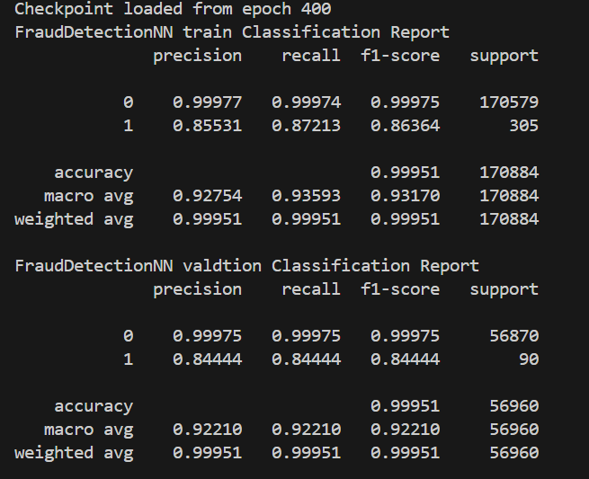

# Credit-Card-Fraud-Detection
---
#### Overview

 This repository contains the code for a Credit Card Fraud Detection project using a dataset from Kaggle, which includes  284,807 credit card transactions with only 492 frauds, is highly unbalanced. To address the class imbalance, the project implements a voting classifier and a neural network with focal loss in PyTorch, achieving an F1-score of 0.86 and 0.85 PR_AUC for the positive class (fraud).     


 ----
#### Installation
Install the required packages

```
pip install -r requirements.txt
```

#### Repo structure and File descriptions

```shall
credit Card Fraud Detection/
├── config/   
│   ├── config.yml 
│   └── trainer_config.yml 
│         
├── data/
│   ├── train.csv
│   ├── val.csv
│   └── test.csv.zip
├── models/
│   ├── 
│   └── 
├── runs/
│   └── ...   
├── .gitignore
├── cradit_fraud_utils_helper.py
├── credit_fraud_train.py
├── credit_fraud_utils_data.py
├── credit_fraud_utils_eval.py
├── eda.ipynb
├── focal_loss.py
├── model_evaluation.py
├── requirements.txt
└── README.md
```

- `config/`
  - `config.yml`: Contains data paths and data preprocessing configuration settings .
  - `trainer_config.yml`: Contains configuration settings specific to the training process, such as trained models, hyperparameters and evaluation matrix.

- `data/`
  - `train.csv`: The training dataset.
  - `val.csv`: The validation dataset.
  - `test.csv.zip`: The test dataset, compressed in a ZIP file.

- `models/`
  - Directory for storing trained models, plots and focal-loss checkpoints. 

- `runs/`
  - Directory for storing logs and results of model runs (tensorboard).

- `.gitignore`: Specifies which files and directories to ignore in the version control system (Git).

- `cradit_fraud_utils_helper.py`: Contains utility functions and helper methods used throughout the project.

- `credit_fraud_train.py`: The main script for training the machine learning models.

- `credit_fraud_utils_data.py`: Contains functions and utilities for data preprocessing and manipulation.

- `credit_fraud_utils_eval.py`: Contains functions and utilities for model evaluation.

- `eda.ipynb`: Jupyter Notebook for Exploratory Data Analysis (EDA) on the training dataset.

- `focal_loss.py`: Implementation of the focal loss function used to handle class imbalance during training.

- `model_evaluation.py`: Script for evaluating the trained models on test data.

- `requirements.txt`: Lists the dependencies and packages required to run the project.
----
#### Usage

```shall
cd Credit-Card-Fraud-Detection
python credit_fraud_train.py --config config.yml --trainer  trainer_config.yml   (for windows)  
python3 credit_fraud_train.py --config config.yml --trainer  trainer_config.yml  (for linux)
```        

**Note: install required packages as above first**

#### Results

.png)

Note:

- The optimal threshold calculated by finding highest F1-score and it's threshold **in training data only**.

------
#### Focal-loss 

Focal Loss is a specialized loss function designed to address the class imbalance problem commonly encountered in tasks like object detection. It was introduced in the paper "Focal Loss for Dense Object Detection." The main idea is to focus more on hard-to-classify examples while reducing the loss contribution from easy-to-classify examples. This is achieved through two parameter 𝛼 (alpha) and 𝛾 (gamma).


#### Focal-loss results 

* I tried Server combination of Alpha (0.80-0.99, +0.5) and gamma (0-4, +1).

* The best result archieve by Alpha 0.75 and gamma 2.



* Notes:
  * Alpth and gamma sometimes unstables train using batchnorm make this effect less occur and switching from Adam to SGD also. 
  * High gamma (5~7) gives very noisey loss curve.

####  Training and the validation curves


#### Smote and undersampling technique 

* SMOTE (Synthetic Minority Over-sampling Technique) is an oversampling method used to generate synthetic samples for the minority class. Despite experimenting with SMOTE, random over-sampling, and under-sampling techniques, the results on the validation data were poor.

* Smote (0.05-ratio) results:
 
* RandomUnderSampler (0.05-ratio) results:
 
